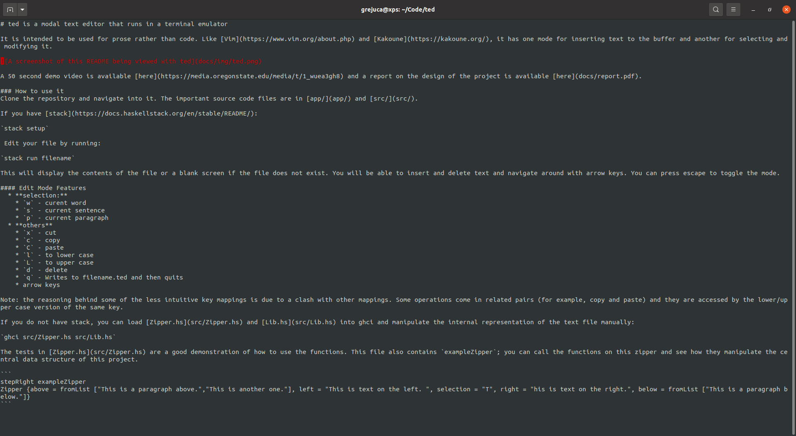

# ted is a modal text editor that runs in a terminal emulator

It is intended to be used for prose rather than code. Like [Vim](https://www.vim.org/about.php) and [Kakoune](https://kakoune.org/), it has one mode for inserting text to the buffer and another for selecting and modifying it.

A 70-second demo video is available [here](https://media.oregonstate.edu/media/t/1_01l6076t) and a report on the design of the project is available [here](docs/report.pdf).

### How to use it

Pull the docker image and run it interactively.

> docker pull alexgrejuc/ted

> docker run -it alexgrejuc/ted

Now you should see something like

> root@6d79e6f0f9c8:/app#

To use the editor, run

> ted demo.txt

This will display the contents of demo.txt. You will be able to insert and delete text and navigate around with arrow keys. You can press escape to toggle the mode. You can also supply another file name, including one that doesn't exist.

#### Edit Mode Features
  * **quitting**
    * `q` - Writes to filename.ted and then quits
  * **selection:**
    * `w` - current word
    * `s` - current sentence
    * `p` - current paragraph
  * **others**
    * `x` - cut
    * `c` - copy
    * `C` - paste
    * `l` - to lower case
    * `L` - to upper case
    * `d` - delete
    * arrow keys

Note: the reasoning behind some of the less intuitive key mappings is due to a clash with other mappings. Some operations come in related pairs (for example, copy and paste) and they are accessed by the lower/upper case version of the same key.

## Dependencies
- ncurses
- directory
- filepath
- containers
- text
- mtl
- text-manipulate
- text-icu

